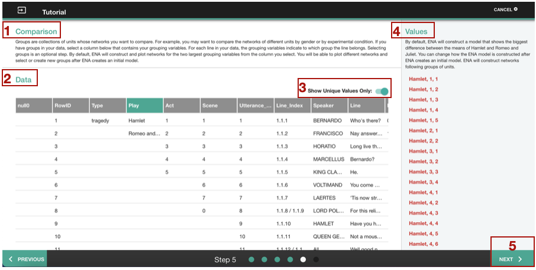
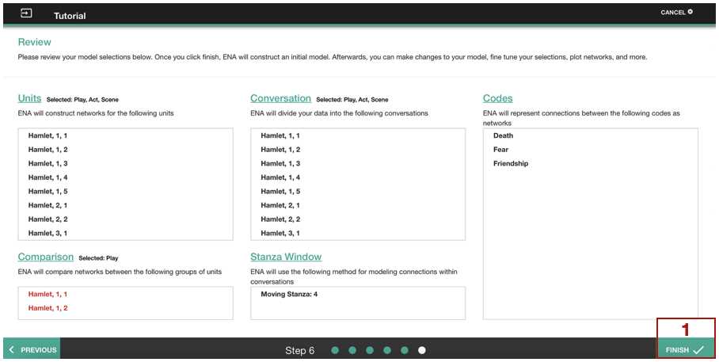

# ENA webtool: Basics {#features}

Go to [epistemicnetwork.org](http://www.epistemicnetwork.org) to launch the Epistemic Network Analysis webtool by clicking on the launch button. You will land on the login page (see Figure \@ref(fig:loginFinal)), where you can either sign up using your email [1] or Google account [2], or login to your ENA webtool account [3].

```{r loginFinal,echo=FALSE, fig.show = "hold", fig.align="center", fig.cap="ENA login page"}
knitr::include_graphics("images/chapter4/loginFinal.png")
```

## Uploading the data

To upload your data to the ENA webtool click *New Project* button first [1] (See Figure \@ref(fig:uploadFinal)). A pop-up window will show up, where you can name your project [2] and create it [3]. The next step is to create a new folder by clicking on *New Folder* [4]. Alternatively, you can choose a default *Sample Folder*. Finally, by clicking on *New Set*, a pop-up window will appear with the following options:

* selection of your data file in a CSV, Excel or Rdata format [5],
* set naming [6],
* two ways of creating a model 1) manually (explained in chapter 5-7), or 2) in a tutorial mode (explained in chapters \@ref(label)) [8].

After you uploaded your data, named your set, and selected model creation mode, click on *Create* [9].

```{r uploadFinal,echo=FALSE, fig.show = "hold", out.extra='angle=90', fig.align="center", fig.width=25/2.54, fig.height=16.9/2.54, fig.cap="Uploading data in the ENA webtool"}

```

## Tutorial mode {#label}

To access tutorial mode to build your ENA model, you have to either choose *Use Tutorial* when uploading the data (See Figure \@ref(fig:uploadFinal), [8]) or you can click on the diamond shape button with an arrow inside in the model page of the ENA webtool (See Figure \@ref(fig:tutorialButtonFinal))

```{r tutorialButtonFinal,echo=FALSE, fig.show = "hold", fig.align="center", fig.cap="Tutorial mode button on the Model page"}

```

The first page in the tutorial mode shows a selection of units (See Figure \@ref(fig:tutorialFinal1)). On the top of the page, you can find a short explanation of units [1] and underneath your dataset [2]. By clicking on the column headers, you can choose your units of analysis. The headers will change colour to green, once chosen. You might want to get an overview of the unique values in your dataset. You can do it by clicking on *Show Unique Values Only* [3]. Your unit selection will show up on the right side of the screen [4]. After you selected the units, click on *Next* [5]. For more information on units go to Chapter \@ref(ena).

```{r tutorialFinal1,echo=FALSE, fig.show = "hold", fig.align="center", fig.cap="Unit selection in the tutorial mode"}

```

You can select your conversations on the second page in the tutorial mode (See Figure \@ref(fig:tutorialFinal2)). On the top of the page, you can find a short definition of conversations [1] and underneath your dataset [2]. By clicking on the column headers, you can choose your conversations. The headers will change colour to green, once chosen. You might want to get an overview of the unique values in your dataset. You can do it by clicking on *Show Unique Values Only* [3]. Your conversation selection will show up on the right side of the screen [4]. After you selected the units, click on *Next* [5]. For more information on conversations go to Chapter \@ref(ena). 

```{r tutorialFinal2,echo=FALSE, fig.show = "hold", fig.align="center", fig.cap="Conversation selection in the tutorial mode"}
knitr::include_graphics("images/chapter4/tutorialFinal2.png")
```

The third page in the tutorial mode shows a selection of stanza window (See Figure \@ref(fig:tutorialFinal3)). On the top of the page, you can find a short explanation of stanza window [1] and underneath your dataset [2]. Above column header you have two options for stanza:

* *Moving Stanza*: the connections are counted within the chosen number of lines limited by a conversation.
* *Whole Conversation*: the connections are counted for one unit within a conversation.

You might want to get an overview of the unique values in your dataset. You can do it by clicking on *Show Unique Values Only* [3]. After you selected the stanza window, click on *Next* [5]. For more information on stanza go to Chapter \@ref(ena). 

```{r tutorialFinal3,echo=FALSE, fig.show = "hold", fig.align="center", fig.cap="Stanza selection in the tutorial mode"}
knitr::include_graphics("images/chapter4/tutorialFinal3.png")
```

You can choose your codes on the fourth page in the tutorial mode (See Figure \@ref(fig:tutorialFinal4)). On the top of the page, you can find a short explanation of codes [1] and underneath your dataset [2]. By clicking on the column headers, you can choose your codes. The headers will change colour to green, once chosen. You have to choose at least 3 codes to create a model. You might want to get an overview of the unique values in your dataset. You can do it by clicking on *Show Unique Values Only* [3]. Other option is *Show Binary Only* that filter the dataset by only binary-coded columns, which are commonly columns with codes. Your code selection will show up on the right side of the screen [4]. After you selected the codes, click on *Next* [5]. For more information on codes go to Chapter \@ref(ena).

```{r tutorialFinal4,echo=FALSE, fig.show = "hold", out.width="80%", fig.align="center", fig.cap="Code selection in the tutorial mode"}
knitr::include_graphics("images/chapter4/tutorialFinal4.png")
```

The fifth page in the tutorial mode enables a selection of comparison groups (See Figure \@ref(fig:tutorialFinal5)). On the top of the page, you can find a short explanation of comparison groups [1] and underneath your dataset [2]. By clicking on a column header, you can choose your comparison groups. The headers will change colour to green, once chosen. You have to choose at least 3 codes to create a model. You might want to get an overview of the unique values in your dataset. You can do it by clicking on *Show Unique Values Only* [3]. Your comparison groups selection will show up on the right side of the screen [4]. After you selected the comparison groups, click on *Next* [5]. 

```{r tutorialFinal5,echo=FALSE, fig.show = "hold", fig.align="center", fig.cap="Comparison group selection in the tutorial mode"}

```

The last page in the tutorial mode shows an overview of all your selections (See Figure \@ref(fig:tutorialFinal6)). You can still change your settings, in the manual mode (See Chapters 4-6). To finish specifying a model, click on *Finish* [1].

```{r tutorialFinal6,echo=FALSE, fig.show = "hold", fig.align="center", fig.cap="Review page in the tutorial mode"}

```

## Plot operations 

The ENA webtool offers three plot visualizations (See Figure \@ref(fig:plotFinal)):

* *Primary Plot* [1] and *Secondary Plot* [2] show singular networks for each comparison group.
* *Comparison Plot* [3] shows a subtracted networks of values of the primary plot and the secondary plot. The connections among codes are color-coded by the comparison group. 

All visualizations are created either by clicking on the network means in the comparison plot (See Figure \@ref(fig:plotFinal)) or by clicking on different plotted points in any plot (See Figure \@ref(fig:plotFinal2)).

You can zoom in [4] or out [5] on any of the plots, or you can recentre the plot view [6] (See Figure \@ref(fig:plotFinal)). To switch between the primary with the secondary plots click on two arrows [7]. There is a possibility to exclude [9] or hide [8] either the primary or secondary plot from the comparison network. 

To download your plot, click on the cloud icon [10]. This will trigger a pop-up window with plot selection. Once you click on *Export*, you will download a zip file with your plots in png format.

```{r plotFinal,echo=FALSE, fig.show = "hold", fig.align="center", width = 60, fig.cap="Plot operations"}

```

```{r plotFinal2,echo=FALSE, fig.show = "hold", fig.align="center", fig.cap="Plotted points networks"}
knitr::include_graphics("images/chapter4/plotFinal2.png")
```

## Set operations

Once you created a set, there are several operations that you can perform. Click on the three dots icon that will appear, when  you hover over your set's name [1]. This will trigger a pop-up window with several options (See Figure \@ref(fig:finalSet)):

* Use *Copy Set* [2] to create several variations of your model. When you click on *Copy Set*, a pop-up window will appear, where you can name the new set. Click on *Copy*, and a copy of the original set will appear in the set list. 
* *Export Set & Data* [3] is useful to share your model with others or to explore how a model would have been developed using the R programming language. It creates a file with data, and an ENA r project file. 
* *Set Details* [4] shows the set specifications of a particular set, such as Units, Conversations etc. 
* *Delete Set*

```{r finalSet,echo=FALSE, fig.show = "hold", fig.align="center",  fig.cap="Set operations"}

```


# ENA webtool: Units 

```{r unitSelection1,echo=FALSE, fig.show = "hold", fig.align="center", fig.cap="Unit selection"}

```

## Mean options

```{r unitsMeans1,echo=FALSE, fig.show = "hold", fig.align="center", fig.cap="Unit means"}

```

## Hide/unhide

```{r unitsHide1,echo=FALSE, fig.show = "hold", fig.align="center", fig.cap="Hiding/unhiding units"}

```

## Exclude/include

```{r unitsExclude1,echo=FALSE, fig.show = "hold", fig.align="center", fig.cap="Excluding/including units"}

```

## Create Sample


## Advanced Options

```{r unitsAdvanced1,echo=FALSE, fig.show = "hold", fig.align="center", fig.cap="Advanced options for units"}

```

### Sphere Norm
### Zero Points at Origin
### Mean Rotation

# ENA webtool: Conversation

## Hide/unhide
## Exclude/include
## Moving Stanza
## Whole Conversation
## Infinite Stanza
## Threaded Data

Siebert-Evenstone, A. L., Irgens, G. A., Collier, W., Swiecki, Z., Ruis, A. R., & Shaffer, D. W. (2017). In Search of Conversational Grain Size: Modelling Semantic Structure Using Moving Stanza Windows. Journal of Learning Analytics, 4(3), 123-139.

# ENA webtool: Codes

## Hide/unhide
## Exclude/include
## Highlight
## Use rotation matrix
## Code variables to display
## Weighted model

# ENA webtool: Plot tools

## Dimensions
### Dimension labels
### Flip dimensions
### Variance explained
### Dimension types

## Plotted points
### Scale units
### Unit labels
### Group labels
### Comparison
### Text size

## Network graph
### Code labels
### Show unconnected codes
### Connection weights
### Minimum edge weight
### Scale for edge weigths
### Weight group networks

# ENA webtool: Data view
## Exclude/include

# ENA webtool: Stats 
## Comparison: parametric/non-parametric
## Goodness of Fit & Variance
## Theory Methods
